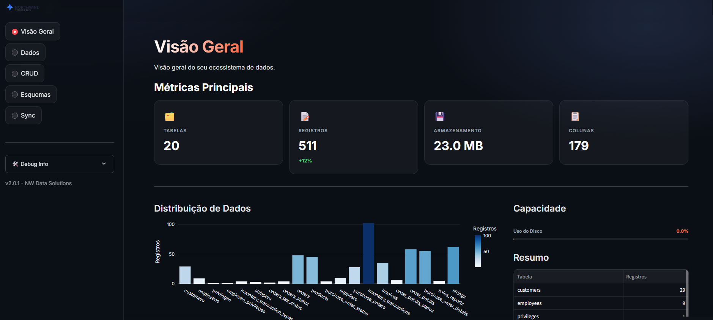
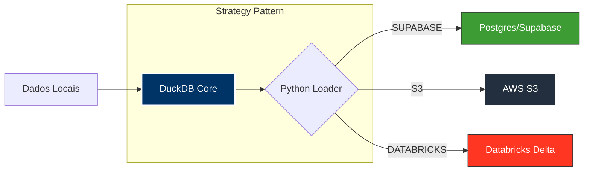

# 🦆 NW-DATA – Pipeline ETL Híbrido

**Categoria:** Engenharia de Dados | Pipeline ETL | Local para Nuvem


[](https://github.com/Rodolfoxxv/NW-Data/stargazers)
[](https://github.com/Rodolfoxxv/NW-Data/network/members)
[](https://github.com/Rodolfoxxv/NW-Data/issues)
[](https://opensource.org/licenses/MIT)
[](https://github.com/Rodolfoxxv/NW-Data/actions/workflows/ci.yml)

[**🌐 Acesse a Demo Ao Vivo**](https://rodolfoxxv-nw-data-appduckdb-app-kerutc.streamlit.app)

Pipeline completo que sincroniza tabelas do DuckDB com Postgres/Supabase e expõe um dashboard Streamlit para explorar o data lake. Ideal para prototipagem, demonstrações ou projetos pessoais em ambientes de ingestão controlada.

<p align="center">
  
</p>



---

## 📋 Índice
- [Características](#-características)
- [Tecnologias](#-tecnologias)
- [Pré-requisitos](#-pré-requisitos)
- [Instalação](#-instalação)
  - [Desenvolvimento Local](#desenvolvimento-local)
  - [Containers Docker](#containers-docker)
- [.env e Configuração](#-env-e-configuração)
- [Estrutura do Projeto](#-estrutura-do-projeto)
- [Execução dos Serviços](#-execução-dos-serviços)
- [Fluxo com Docker](#-fluxo-com-docker)
- [CI/CD](#-cicd)
- [Dados de Exemplo](#-dados-de-exemplo)
- [Testes](#-testes)
- [Troubleshooting](#-troubleshooting)
- [Roadmap](#-roadmap)
- [Como Contribuir](#-como-contribuir)
- [Licença](#-licença)

---

## ✨ Arquitetura em Camadas

O projeto implementa um pipeline de dados robusto dividido em três camadas lógicas, simulando um ambiente de produção moderno:

### 1. Camada de Preparação (Staging Local) - **DuckDB**
Atua como um **Data Lake local** e de alta performance.
- Armazena dados brutos e estruturados antes da subida para a nuvem.
- Gerencia metadados e integridade referencial localmente.
- Permite validação de schemas e exploração rápida via Dashboard sem custo de latência de rede.

### 2. Camada de Ingestão & ETL - **Python Core**
O "cérebro" do sistema que conecta o local à nuvem.
- **Topological Sort:** Garante que tabelas sejam carregadas na ordem correta baseada em suas dependências (FKs).
- **CDC (Change Data Capture) Simplificado:** Detecta `updated_at` para sincronizar apenas deltas (registros novos ou modificados).
- **Resiliência:** Lógica de *retry* exponencial para lidar com falhas de rede.

### 3. Camada de Servir (Serving Layer) - **Supabase / Postgres**
O destino final persistente na nuvem.
- **Single Source of Truth:** Onde os dados ficam disponíveis para consumo por APIs, BI ou outras aplicações.
- Recebe dados limpos e validados, mantendo a integridade referencial do modelo original.

## 🔌 Extensibilidade Multi-Cloud (Strategy Pattern)
O projeto foi arquitetado utilizando o **Padrão Strategy**, permitindo trocar o destino dos dados apenas alterando uma variável de ambiente, sem refatorar o código.

| Destino | Status | Descrição |
| --- | --- | --- |
| **Supabase (Postgres)** | ✅ Ativo | Carga via `INSERT` otimizado (Batch) com controle transacional. |
| **AWS S3** | 🚀 Pronto | Exportação direta de Parquet via DuckDB `httpfs` (Zero-Copy). |
| **Databricks** | 🚀 Pronto | Conexão via `databricks-sql-connector` para Delta Lake. |

---

## ⚙️ `.env` e Configuração

| Variável | Descrição |
| --- | --- |
| `DESTINATION_TYPE` | Define o driver de saída: `SUPABASE` (default), `S3` ou `DATABRICKS`. |
| `DUCKDB_PATH` | Nome do arquivo DuckDB (relativo ao `DESTINATION_PATH`). |
| `DESTINATION_PATH` | Diretório onde o arquivo DuckDB é lido/grava (ex.: `./data`). |
| **Credenciais Supabase** | `DB_HOST`, `DB_NAME`, `DB_USER`, `DB_PASSWORD`... |
| **Credenciais S3** | `AWS_ACCESS_KEY_ID`, `AWS_SECRET_ACCESS_KEY`, `S3_BUCKET_NAME` (se `DESTINATION_TYPE=S3`). |
| **Credenciais Databricks** | `DATABRICKS_HOST`, `DATABRICKS_TOKEN`, `DATABRICKS_HTTP_PATH` (se `DESTINATION_TYPE=DATABRICKS`). |

> **Dica Windows:** se não quiser instalar `make`, execute os comandos equivalentes (`python scripts/...` ou `streamlit run ...`) diretamente no PowerShell.

---

## 📂 Estrutura do Projeto

```
data_lk/
├── app/
│   └── duckdb_app.py          # Dashboard Streamlit
├── scripts/
│   ├── bootstrap_duckdb.py    # Gera as tabelas teste
│   └── incremental_loader.py  # Loader incremental DuckDB x Postgres  
├── data/                      
├── tests/
│   └── test_incremental_loader.py
├── docker-compose.yml
├── Makefile
├── requirements.txt
├── README.md
└── .env / .env.example
```

---

## ▶️ Execução dos Serviços

| Objetivo | Comando sugerido |
| --- | --- |
| Gerar dados de exemplo | `python scripts/bootstrap_duckdb.py` |
| Rodar loader incremental | `python scripts/incremental_loader.py` |
| Abrir dashboard Streamlit | `streamlit run app/duckdb_app.py` |
| Rodar com Make (Linux/Mac ou Windows com make) | `make bootstrap`, `make run-loader`, `make run-app` |

O loader registra cada execução na tabela `controle_cargas`, criando tabelas no Postgres caso ainda não existam, sincronizando PK/FK e aplicando incrementais guiados por timestamp.

---

## 🐳 Fluxo com Docker

1. `docker compose build` – imagens atualizadas (app + loader).
2. `docker compose up -d` – sobe app Streamlit (porta 8501) compartilhando `./data`.
3. `docker compose run --rm --profile loader loader` – executa o loader no mesmo ambiente.
4. `docker compose down` – encerra os serviços.

Os contêineres montam `./data`, garantindo que o arquivo DuckDB seja o mesmo do host.

---

## 🔄 CI/CD

- `.github/workflows/ci.yml`: instala dependências, roda `scripts/bootstrap_duckdb.py` e executa `pytest` a cada push/PR.
- `.github/workflows/pipeline.yml`: executa o loader contra o Postgres/Supabase real ao fazer push na `main`. Recomenda-se armazenar o DuckDB como secret base64 (`DUCKDB_BASE64`) e reconstruí-lo durante o job:
  ```bash
  echo "$DUCKDB_BASE64" | base64 -d > "$DESTINATION_PATH/$DUCKDB_PATH"
  ```
- Secrets adicionais como `DB_SSLMODE`/`DB_SSLROOTCERT` podem ser exportadas na etapa de “Set up environment variables”.

---

## 🗃️ Dados de Exemplo

`scripts/bootstrap_duckdb.py` cria e popula:
- `clientes`
- `pedidos`
- `itens_pedido`
- `pagamentos`
- `table_metadata` e `fk_metadata`

Executar o script é seguro mesmo repetidamente: ele limpa as tabelas, recria metadados e deixa o arquivo pronto para novas demos.

---

## 🧪 Testes

```bash
pytest -q
# ou
make test
```

Os testes cobrem funções críticas como mapeamento de tipos e ordenação topológica das tabelas para garantir que as dependências sejam respeitadas antes da carga.

---

## 🆘 Troubleshooting

- **`ValueError: Variáveis de ambiente ausentes`** – confira se `.env` existe e foi preenchido.
- **`FileNotFoundError: Arquivo DuckDB não encontrado`** – execute o bootstrap ou ajuste `DESTINATION_PATH`.
- **`psycopg2.OperationalError`** – valide credenciais/IP liberado no Postgres/Supabase e, se SSL estiver habilitado, defina `DB_SSLMODE`/`DB_SSLROOTCERT`.
- **`make` não encontrado no Windows** – instale `make` via Chocolatey ou execute os comandos Python/Streamlit diretamente.

---

## 🗺️ Roadmap

Funcionalidades planejadas para próximas versões:

### v2.0 (Em andamento)
- [x] Strategy Pattern para múltiplos destinos
- [x] Suporte a Supabase/PostgreSQL
- [x] Suporte a AWS S3 (Parquet)
- [x] Suporte a Databricks Delta Lake
- [x] Dashboard Streamlit interativo
- [x] CI/CD com GitHub Actions

### v2.1 (Próximo)
- [ ] Particionamento automático para tabelas grandes
- [ ] Suporte a Google BigQuery
- [ ] Métricas de observabilidade (Prometheus/Grafana)
- [ ] Agendamento de sincronizações (Airflow/Prefect)
- [ ] Suporte a transformações SQL (dbt-core)

### v3.0 (Futuro)
- [ ] Interface web para gerenciamento de pipelines
- [ ] Versionamento de esquemas (data versioning)
- [ ] Suporte a streaming (Kafka/Kinesis)
- [ ] Data quality checks automáticos
- [ ] Multi-tenancy

**Sugestões?** Abra uma [issue](../../issues) com a tag `enhancement`!

---

## 🤝 Como Contribuir

Contribuições são muito bem-vindas! Este é um projeto open source e a comunidade é essencial para seu crescimento.

### Formas de Contribuir:
- 🐛 Reportar bugs
- 💡 Sugerir novas funcionalidades
- 📝 Melhorar documentação
- 🔧 Implementar features
- ⭐ Dar uma estrela no projeto

### Começando:
1. Leia o [CONTRIBUTING.md](CONTRIBUTING.md) para diretrizes detalhadas
2. Confira as [issues abertas](../../issues) marcadas como `good first issue`
3. Faça um fork, desenvolva e abra um Pull Request
4. Participe das [Discussions](../../discussions)

**Todas as contribuições serão reconhecidas!**

---

## 📄 Licença

Este projeto é distribuído sob a licença MIT. Consulte [LICENSE](LICENSE) para mais detalhes.

---

## 🙌 Autor

**Rodolfo Fonseca**

- 💼 GitHub: [@RodolfoxvData](https://github.com/RodolfoxvData)
- 💬 Dúvidas ou colaborações? Abra uma [issue](../../issues)

---


