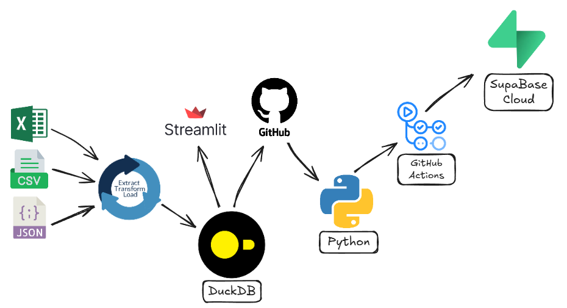

# NW-Data

## Descrição do Projeto

**NW-Data** é um pipeline de processamento e análise de dados baseado em **DuckDB** e **Supabase**, projetado para carregar, transformar e gerenciar tabelas de forma eficiente. O projeto inclui uma estrutura ETL completa e uma aplicação em **Streamlit** para visualização e consulta de dados.



## Tecnologias Utilizadas

- **Python**
- **DuckDB**
- **Supabase**
- **Streamlit**
- **uv**

## Instalação

1. **Clone o repositório:**

   ```bash
   git clone https://github.com/Rodolfoxxv/NW-Data.git
   cd NW-Data
   ```

2. **Crie um ambiente virtual (opcional, mas recomendado):**

   ```bash
   pip install uv
   uv venv
   ```

3. **Instale as dependências usando `uv`:**

   ```bash
   uv sync
   ```

## Configuração

1. **Crie um arquivo `.env` na pasta `scripts` e defina as variáveis de ambiente:**

   ```ini
   DUCKDB_PATH=database.duckdb
   DB_HOST=seu_host_postgres
   DB_NAME=nome_do_banco_de_dados
   DB_USER=seu_usuario
   DB_PASSWORD=sua_senha
   DB_PORT=5432 
   ```

## Uso

1. **Execute o pipeline de carregamento incremental:**

   ```bash
   python scripts/incremental_loader.py
   ```

2. **Inicie a aplicação de visualização DuckDB com Streamlit:**

   ```bash
   streamlit run app/duckdb_app.py
   ```

## Estrutura do Projeto

```text
NW-Data/
├── app/
│   └── duckdb_app.py 
├── data/
│   └── database.duckdb
├── ETL/
│   └── ...  # Scripts de ETL
├── scripts/
│   ├── incremental_loader.py  # Pipeline
│   └── ...  # Outros scripts
├── .venv/ 
├── .gitignore 
├── LICENSE 
├── README.md
├── pipeline.log 
└── pyproject.toml
```

## Contribuição

Contribuições são bem-vindas! Para contribuir:

1. Faça um fork do repositório.
2. Crie uma branch para sua feature (`git checkout -b feature/nova-feature`).
3. Commit suas mudanças (`git commit -m 'Adiciona nova feature'`).
4. Faça um push para a branch (`git push origin feature/nova-feature`).
5. Abra um Pull Request.

## Licença

Este projeto está licenciado sob a **MIT License**. Consulte o arquivo `LICENSE` para mais detalhes.
